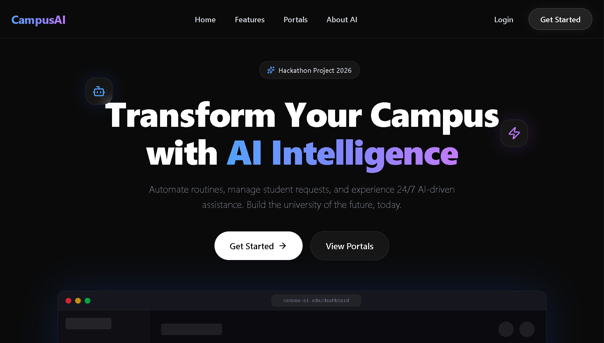

<div align="center">
  
  
  
  
</div>

<br/>

---

## 🚀 About The Project
**CampusAI** is a premium, AI-powered university management system built for modern educational institutions. Designed with a multi-portal architecture, it provides dedicated, secure, and intuitive interfaces for Students, Faculty, and Administrators. 

Built for high performance and seamless user experience, CampusAI automates tedious academic tasks using Artificial Intelligence, ranging from routine generation to document verification and lecture material creation.

---

## ✨ Key Features

### 🎓 Student Portal
* **Smart Routine Generator:** An SMC-inspired, conflict-free visual timeline for classes, powered by constraint satisfaction algorithms.
* **AI Document Scanner (OCR):** Upload previous grade sheets to automatically extract and verify CGPA and credits for service requests.
* **Real-time Helpdesk:** AI-powered assistance for academic queries and schedule insights.

### 👨‍🏫 Faculty Portal
* **AI Course Material Generator:** Instantly convert raw topics into structured lecture notes, summaries, and practice MCQs.
* **Class Management:** Track upcoming lectures, labs, and capstone project progress.
* **Smart Dashboard:** Comprehensive overview of student metrics and prepared materials.

### 🛡️ Core Infrastructure
* **Role-Based Access Control (RBAC):** Secure middleware routing using Supabase Authentication.
* **Dynamic Themes:** Context-aware UI themes (Blue for Students, Purple for Faculty).
* **Smooth Animations:** Premium micro-interactions and page transitions using Framer Motion.

---

## 🛠️ Tech Stack
* **Frontend:** Next.js (App Router), React, Tailwind CSS
* **Backend/Auth:** Supabase (PostgreSQL, Auth, RLS Policies)
* **Animations:** Framer Motion
* **Icons:** Lucide React

---

## 🚀 Live Demo
[Click here to view the live project](https://campus-ai-diu.vercel.app) 



---

## ⚙️ Getting Started

Follow these steps to set up the project locally on your machine.

### Prerequisites
Make sure you have `Node.js` installed.

### Installation

1. **Clone the repository**
   ```bash
   git clone https://github.com/atul-dev-ai/campus-ai.git
   ```
   ```bash
   cd campus-ai
   ```

2. **Install dependencies**
   ```bash
   npm install
   ```
   
3. **Set up Environment Variables**
Create a `.env.local` file in the root directory and add your Supabase credentials:

   ```Code snippet
   NEXT_PUBLIC_SUPABASE_URL=your_supabase_project_url
   ```
   
   ```Code snippet
   NEXT_PUBLIC_SUPABASE_ANON_KEY=your_supabase_anon_key
   ```

4. **Run the development server**
   ```bash
   npm run dev
   
Open `http://localhost:3000` with your browser to see the result.

## 👥 Meet the Team

| Name | Role | Focus Area |
| :--- | :--- | :--- |
| **Atul Paul** | Lead Web Developer | Next.js Architecture, UI/UX, Full-Stack Integration |
| **Nafisa Tabassum** | Lead AI Developer | Chatbot Engine, NLP, AI Automation Logic |
| **Shakila Alo** | Lead Researcher | Academic Workflows, Data Modeling, Feature Ideation |


"Building the future of campus management, one line of code at a time."
